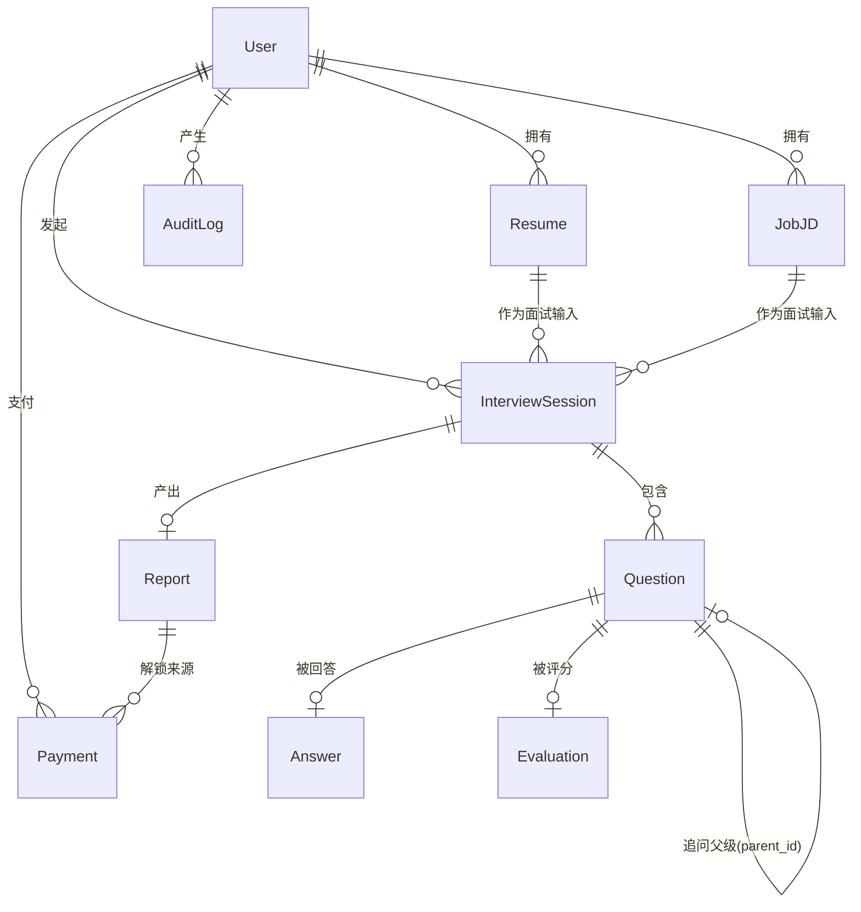

# 数据模型（V1）

> 本文档是**枚举与字段的单一真源**。其他文档（PRD / ARCHITECTURE / AI_PROMPTS / UI）引用本文，不重复定义。
> 上位依据：[AGENTS.md](../../AGENTS.md) §5（数据模型）、§6（AI 评分规则）、§7（合规）。
> 实现位置：`db/schema/`，迁移产物 `db/migrations/`。

---

## 1. ER 图



**关系基数说明**

| 关系 | 基数 | 说明 |
|---|---|---|
| `User → Resume` | 1:N | 一个用户多份简历 |
| `User → JobJD` | 1:N | 一个用户多个目标岗位 |
| `InterviewSession → Question` | 1:N | 一场面试多道题（含追问） |
| `Question → Question` | 自引用 1:N | `parent_id` 指向主问题，构成追问链 |
| `Question → Answer` | 1:0..1 | 一题一次回答（V1 不支持重复作答） |
| `Question → Evaluation` | 1:0..1 | 一题一次评分 |
| `InterviewSession → Report` | 1:0..1 | 面试结束才产出报告 |
| `Report → Payment` | 1:N | 一次报告可被多次/多种方式解锁（幂等由唯一约束保证） |

---

## 2. 枚举定义（单一真源）

实现为 PostgreSQL `ENUM` 类型（`db/schema/enums.ts`）。**新增取值必须走迁移**，禁止在代码里散落字符串字面量。

### 2.1 `membership_level` — 用户会员等级

| 值 | 含义 |
|---|---|
| `free` | 免费用户（默认） |
| `plus` | 付费会员（次数包 / 订阅） |
| `pro` | 高级会员 |

### 2.2 `session_status` — 面试会话状态机

| 值 | 含义 | 允许的下一状态 |
|---|---|---|
| `draft` | 已创建，尚未生成面试计划 | `planned`、`cancelled` |
| `planned` | 已生成题目清单 | `in_progress`、`cancelled` |
| `in_progress` | 面试进行中 | `completed`、`cancelled`、`failed` |
| `completed` | 正常结束（可生成报告） | — |
| `cancelled` | 用户主动取消 | — |
| `failed` | 异常终止（如 AI 连续失败） | — |

> **不变量**：非法迁移必须在服务层拒绝（AGENTS.md §5）。`completed` 为终态，进入后不再变更。

### 2.3 `question_type` — 题目类型

| 值 | 对应面试计划环节 |
|---|---|
| `self_intro` | 自我介绍 |
| `project_dig` | 项目深挖 |
| `technical` | 专业题 |
| `behavioral` | 行为题 |
| `reverse` | 反问环节 |

### 2.4 `question_source` — 题目来源（AGENTS.md §5「来源（JD/简历/通用）」）

| 值 | 含义 |
|---|---|
| `jd` | 依据岗位 JD 生成 |
| `resume` | 依据简历经历生成 |
| `both` | JD 与简历交叉生成（主流） |
| `generic` | 通用题（如自我介绍、反问） |

### 2.5 `answer_source` — 回答录入方式

| 值 | 含义 |
|---|---|
| `text` | 用户直接打字 |
| `voice` | 语音输入，经 ASR 转写 |

### 2.6 `score_dimension` — 评分维度（AGENTS.md §6.2，六项）

| 值 | 中文名 |
|---|---|
| `job_match` | 岗位匹配 |
| `professional` | 专业能力 |
| `project_depth` | 项目深度 |
| `logic` | 逻辑表达 |
| `communication` | 沟通表达 |
| `motivation` | 动机稳定性 |

### 2.7 `payment_status` — 订单状态

| 值 | 含义 |
|---|---|
| `pending` | 已创建，待支付 |
| `paid` | 支付成功 |
| `failed` | 支付失败 |
| `refunded` | 已退款 |
| `cancelled` | 已取消（超时/用户放弃） |

### 2.8 `unlock_type` — 解锁类型（AGENTS.md §5「会员与次数分离」）

| 值 | 含义 |
|---|---|
| `report` | 单份报告解锁（按次付费） |
| `package` | 次数包（购买 N 次） |
| `subscription` | 订阅制会员 |

### 2.9 `consent_type` — 用户同意类型（AGENTS.md §7 C1/C2）

| 值 | 含义 |
|---|---|
| `terms` | 用户协议 |
| `privacy` | 隐私政策 |
| `ai_disclosure` | AI 生成内容与模拟性质说明 |

---

## 3. 表定义

### 3.1 `users` — 用户

| 字段 | 类型 | 约束 | 默认 | 说明 |
|---|---|---|---|---|
| `id` | `uuid` | PK | `gen_random_uuid()` | 主键 |
| `email` | `varchar(255)` | NOT NULL | — | 登录凭证；**存小写规范化值** |
| `password_hash` | `text` | NOT NULL | — | Argon2id/scrypt 哈希，**禁止明文** |
| `name` | `varchar(100)` | NULL | — | 昵称 |
| `avatar_url` | `text` | NULL | — | 头像 |
| `membership` | `membership_level` | NOT NULL | `free` | 会员等级 |
| `free_credits` | `integer` | NOT NULL, `>= 0` | `1` | 剩余免费面试次数 |
| `email_verified_at` | `timestamptz` | NULL | — | Phase 1 无邮件服务，仅标记待验证 |
| `terms_accepted_at` | `timestamptz` | NULL | — | 同意时间戳（C1） |
| `created_at` | `timestamptz` | NOT NULL | `now()` | — |
| `updated_at` | `timestamptz` | NOT NULL | `now()` | 应用层维护 |
| `deleted_at` | `timestamptz` | NULL | — | 软删除（C3）；`NULL` 表示有效 |

**约束与索引**

| 类型 | 定义 | 目的 |
|---|---|---|
| 唯一索引 | `users_email_unique (email) WHERE deleted_at IS NULL` | 软删除后邮箱可复用 |
| 索引 | `users_membership_idx (membership)` | 管理后台筛选 |
| 索引 | `users_created_at_idx (created_at)` | 管理后台按时间排序 |
| CHECK | `free_credits >= 0` | 次数不可为负 |
| CHECK | `membership IN (...)` | 枚举由 PG 类型保证，此处冗余防御 |

---

### 3.2 `resumes` — 简历

| 字段 | 类型 | 约束 | 默认 | 说明 |
|---|---|---|---|---|
| `id` | `uuid` | PK | `gen_random_uuid()` | — |
| `user_id` | `uuid` | NOT NULL, FK→`users.id` ON DELETE CASCADE | — | 归属 |
| `file_name` | `varchar(255)` | NOT NULL | — | 原始文件名 |
| `file_type` | `varchar(20)` | NOT NULL | — | `pdf` / `docx` / `doc` / `png` / `jpg` / `jpeg` |
| `file_size` | `integer` | NOT NULL, `> 0` | — | 字节 |
| `storage_key` | `text` | NOT NULL | — | S3 对象 key（C3：加密存储） |
| `raw_text` | `text` | NULL | — | 抽取的原始文本 |
| `parsed_data` | `jsonb` | NULL | — | 结构化信息（schema 见 AI_PROMPTS.md） |
| `parse_status` | `varchar(20)` | NOT NULL | `pending` | `pending`/`processing`/`success`/`failed` |
| `parse_error` | `text` | NULL | — | 失败原因 |
| `is_primary` | `boolean` | NOT NULL | `false` | 默认简历 |
| `created_at` / `updated_at` | `timestamptz` | NOT NULL | `now()` | — |
| `deleted_at` | `timestamptz` | NULL | — | 软删除 |

**索引**：`resumes_user_id_idx (user_id, created_at DESC)`；`resumes_parse_status_idx (parse_status)`（异步解析轮询）；
部分唯一索引 `resumes_user_primary_unique (user_id) WHERE is_primary AND deleted_at IS NULL`（每用户至多一份默认简历）。

---

### 3.3 `job_jds` — 岗位 JD

| 字段 | 类型 | 约束 | 默认 | 说明 |
|---|---|---|---|---|
| `id` | `uuid` | PK | `gen_random_uuid()` | — |
| `user_id` | `uuid` | NOT NULL, FK→`users.id` CASCADE | — | 归属 |
| `title` | `varchar(200)` | NULL | — | 岗位名称（可从解析结果回填） |
| `company` | `varchar(200)` | NULL | — | 公司 |
| `source_url` | `text` | NULL | — | 来源链接 |
| `raw_text` | `text` | NOT NULL | — | JD 原文（粘贴或上传抽取） |
| `parsed_data` | `jsonb` | NULL | — | 结构化要求（schema 见 AI_PROMPTS.md） |
| `parse_status` | `varchar(20)` | NOT NULL | `pending` | 同 `resumes.parse_status` |
| `parse_error` | `text` | NULL | — | — |
| `created_at` / `updated_at` | `timestamptz` | NOT NULL | `now()` | — |
| `deleted_at` | `timestamptz` | NULL | — | 软删除 |

**索引**：`job_jds_user_id_idx (user_id, created_at DESC)`；`job_jds_parse_status_idx (parse_status)`。

---

### 3.4 `interview_sessions` — 面试会话

| 字段 | 类型 | 约束 | 默认 | 说明 |
|---|---|---|---|---|
| `id` | `uuid` | PK | `gen_random_uuid()` | — |
| `user_id` | `uuid` | NOT NULL, FK→`users.id` CASCADE | — | 归属 |
| `resume_id` | `uuid` | NULL, FK→`resumes.id` SET NULL | — | 面试输入（可空以容忍用户删简历） |
| `job_jd_id` | `uuid` | NULL, FK→`job_jds.id` SET NULL | — | 面试输入 |
| `status` | `session_status` | NOT NULL | `draft` | 状态机，见 §2.2 |
| `config` | `jsonb` | NOT NULL | `'{}'` | 面试配置：`{ durationMin, maxQuestions, difficulty }` |
| `match_analysis` | `jsonb` | NULL | — | 匹配分析结果 |
| `plan` | `jsonb` | NULL | — | 面试计划（各环节题目配额） |
| `started_at` | `timestamptz` | NULL | — | 进入 `in_progress` 时间 |
| `finished_at` | `timestamptz` | NULL | — | 进入 `completed` 时间 |
| `created_at` / `updated_at` | `timestamptz` | NOT NULL | `now()` | — |
| `deleted_at` | `timestamptz` | NULL | — | 软删除 |

**索引**：`sessions_user_status_idx (user_id, status, created_at DESC)`（历史列表主查询）；
`sessions_user_created_idx (user_id, created_at DESC)`。

**服务层不变量**
- 状态迁移必须匹配 §2.2 表格，否则抛错。
- `status = 'completed'` 时 `finished_at` 必须非空。
- 只有 `planned` 状态允许进入 `in_progress`。

---

### 3.5 `questions` — 问题

| 字段 | 类型 | 约束 | 默认 | 说明 |
|---|---|---|---|---|
| `id` | `uuid` | PK | `gen_random_uuid()` | — |
| `session_id` | `uuid` | NOT NULL, FK→`interview_sessions.id` CASCADE | — | 归属会话 |
| `parent_id` | `uuid` | NULL, FK→`questions.id` CASCADE | — | **追问父级**；`NULL` 为主问题 |
| `root_id` | `uuid` | NULL, FK→`questions.id` CASCADE | — | **主问题根节点**；主问题自身为 `NULL` 或等于 `id` |
| `depth` | `smallint` | NOT NULL, `0 <= depth <= 2` | `0` | **追问层级**：主问题 0，追问 1，追问的追问 2 |
| `order_index` | `integer` | NOT NULL | — | 会话内展示顺序（含追问，全局递增） |
| `type` | `question_type` | NOT NULL | — | 题型 |
| `source` | `question_source` | NOT NULL | — | 来源 |
| `content` | `text` | NOT NULL | — | 题干 |
| `intent` | `text` | NULL | — | 考察意图（便于反馈） |
| `created_at` | `timestamptz` | NOT NULL | `now()` | — |

**约束与索引**

| 类型 | 定义 | 目的 |
|---|---|---|
| CHECK | `depth BETWEEN 0 AND 2` | 硬约束「最多追问 2 层」（AGENTS.md §2 第 7 步） |
| CHECK | `(depth = 0 AND parent_id IS NULL) OR (depth > 0 AND parent_id IS NOT NULL)` | depth 与父级必须自洽 |
| 唯一索引 | `questions_session_order_unique (session_id, order_index)` | 顺序不重复 |
| 索引 | `questions_session_idx (session_id, order_index)` | 按序取题 |
| 索引 | `questions_root_idx (root_id, depth)` | **按主问题聚合追问链**，校验上限与生成报告 |

> **追问上限的实现口径**：上限按 **`root_id` 分组**统计 `depth = 2` 的节点数，而非全局。
> 即每道**主问题**最多 2 层追问；`root_id` 让这条规则可在 SQL 层校验。

---

### 3.6 `answers` — 回答

| 字段 | 类型 | 约束 | 默认 | 说明 |
|---|---|---|---|---|
| `id` | `uuid` | PK | `gen_random_uuid()` | — |
| `question_id` | `uuid` | NOT NULL, **UNIQUE**, FK→`questions.id` CASCADE | — | 一题一答 |
| `user_id` | `uuid` | NOT NULL, FK→`users.id` CASCADE | — | **冗余归属**，用于免 JOIN 权限校验 |
| `content` | `text` | NOT NULL | — | 回答正文（语音时为转写文本） |
| `source` | `answer_source` | NOT NULL | `text` | 录入方式 |
| `audio_storage_key` | `text` | NULL | — | 语音原件 key（保留以便复查） |
| `duration_ms` | `integer` | NULL, `>= 0` | — | **耗时**（AGENTS.md §5） |
| `created_at` / `updated_at` | `timestamptz` | NOT NULL | `now()` | — |

**索引**：`answers_question_unique (question_id)`；`answers_user_idx (user_id)`。

---

### 3.7 `evaluations` — 逐题评分

| 字段 | 类型 | 约束 | 默认 | 说明 |
|---|---|---|---|---|
| `id` | `uuid` | PK | `gen_random_uuid()` | — |
| `question_id` | `uuid` | NOT NULL, **UNIQUE**, FK→`questions.id` CASCADE | — | 一题一评 |
| `session_id` | `uuid` | NOT NULL, FK→`interview_sessions.id` CASCADE | — | 冗余，便于按会话聚合 |
| `dimension_scores` | `jsonb` | NOT NULL | — | `{"job_match":4,"professional":3,...}`，六维各 0–5 |
| `question_score` | `numeric(4,1)` | NOT NULL, `0 <= x <= 100` | — | 该题折算分（公式见 §5） |
| `feedback` | `text` | NOT NULL | — | 反馈文本 |
| `evidence_quotes` | `jsonb` | NOT NULL | — | **证据引用**：`[{"quote":"...","reason":"..."}]`，禁止为空数组（N6） |
| `ai_model` | `varchar(100)` | NULL | — | 生成所用模型 |
| `prompt_version` | `varchar(30)` | NULL | — | prompt 版本（C6 审计） |
| `created_at` | `timestamptz` | NOT NULL | `now()` | — |

**索引**：`evaluations_question_unique (question_id)`；`evaluations_session_idx (session_id)`。
**CHECK**：`jsonb_array_length(evidence_quotes) > 0` —— 让「评分必须引用证据」（N6）在数据库层无法绕过。

---

### 3.8 `reports` — 总报告

| 字段 | 类型 | 约束 | 默认 | 说明 |
|---|---|---|---|---|
| `id` | `uuid` | PK | `gen_random_uuid()` | — |
| `session_id` | `uuid` | NOT NULL, **UNIQUE**, FK→`interview_sessions.id` CASCADE | — | 一场面试一份报告 |
| `user_id` | `uuid` | NOT NULL, FK→`users.id` CASCADE | — | 冗余归属 |
| `total_score` | `numeric(5,1)` | NOT NULL, `0 <= x <= 100` | — | 总分 |
| `dimension_scores` | `jsonb` | NOT NULL | — | 六维汇总分（各 0–5） |
| `highlights` | `jsonb` | NOT NULL | `'[]'` | **亮点** |
| `issues` | `jsonb` | NOT NULL | `'[]'` | **问题** |
| `reference_answers` | `jsonb` | NOT NULL | `'[]'` | **参考回答** |
| `next_steps` | `jsonb` | NOT NULL | `'[]'` | **下一步建议** |
| `summary` | `text` | NULL | — | 总评 |
| `is_unlocked` | `boolean` | NOT NULL | `false` | 付费解锁标记（权威值见 `payments`） |
| `unlocked_at` | `timestamptz` | NULL | — | — |
| `created_at` / `updated_at` | `timestamptz` | NOT NULL | `now()` | — |

**索引**：`reports_session_unique (session_id)`；`reports_user_idx (user_id, created_at DESC)`。

> **四要素强制**：`highlights` / `issues` / `reference_answers` / `next_steps` 为 NOT NULL（AGENTS.md §6.1 N7）。
> **免费/付费边界**：免费可见 `total_score` + `dimension_scores` + `highlights`；
> 付费解锁 `issues` + `reference_answers` + `next_steps` + 逐题 `evaluations`。

---

### 3.9 `payments` — 订单与解锁

| 字段 | 类型 | 约束 | 默认 | 说明 |
|---|---|---|---|---|
| `id` | `uuid` | PK | `gen_random_uuid()` | — |
| `user_id` | `uuid` | NOT NULL, FK→`users.id` CASCADE | — | 归属 |
| `report_id` | `uuid` | NULL, FK→`reports.id` SET NULL | — | `unlock_type='report'` 时必填 |
| `unlock_type` | `unlock_type` | NOT NULL | — | 见 §2.8 |
| `amount_cents` | `integer` | NOT NULL, `>= 0` | — | 金额（分），避免浮点误差 |
| `currency` | `varchar(3)` | NOT NULL | `'CNY'` | 币种 |
| `status` | `payment_status` | NOT NULL | `pending` | 见 §2.7 |
| `provider` | `varchar(30)` | NULL | — | 支付渠道（**TBD，见 ARCHITECTURE.md §7**） |
| `provider_order_id` | `varchar(100)` | NULL | — | 渠道订单号 |
| `credits_granted` | `integer` | NOT NULL | `0` | 本次授予的次数（`package`） |
| `paid_at` | `timestamptz` | NULL | — | — |
| `created_at` / `updated_at` | `timestamptz` | NOT NULL | `now()` | — |

**约束与索引**

| 类型 | 定义 | 目的 |
|---|---|---|
| 唯一索引 | `payments_provider_order_unique (provider, provider_order_id) WHERE provider_order_id IS NOT NULL` | **支付回调幂等** |
| 唯一索引 | `payments_report_unlock_unique (report_id) WHERE unlock_type = 'report' AND status = 'paid'` | 同一报告不重复解锁 |
| CHECK | `amount_cents >= 0`；`credits_granted >= 0` | — |
| CHECK | `unlock_type <> 'report' OR report_id IS NOT NULL` | 单报告解锁必须关联报告 |
| 索引 | `payments_user_idx (user_id, created_at DESC)` | 订单列表 |
| 索引 | `payments_status_idx (status)` | 对账 |

---

### 3.10 `audit_logs` — 审计日志（AGENTS.md §7 C6）

| 字段 | 类型 | 约束 | 默认 | 说明 |
|---|---|---|---|---|
| `id` | `bigserial` | PK | — | 高写入量表用自增 |
| `actor_id` | `uuid` | NULL | — | 操作用户（系统操作可为空） |
| `action` | `varchar(60)` | NOT NULL | — | 如 `auth.login`、`report.unlock`、`user.delete` |
| `target_type` | `varchar(40)` | NULL | — | 资源类型 |
| `target_id` | `uuid` | NULL | — | 资源 ID |
| `metadata` | `jsonb` | NOT NULL | `'{}'` | 附加信息（**禁止写入密码/令牌明文**） |
| `ip` | `inet` | NULL | — | 来源 IP |
| `user_agent` | `text` | NULL | — | — |
| `created_at` | `timestamptz` | NOT NULL | `now()` | — |

**索引**：`audit_logs_actor_idx (actor_id, created_at DESC)`；`audit_logs_action_idx (action, created_at DESC)`。
**保留策略**：默认保留 180 天，删除用户数据时**保留**审计记录但清除 `metadata` 中的个人数据。

---

### 3.11 `sessions` — 登录会话

| 字段 | 类型 | 约束 | 默认 | 说明 |
|---|---|---|---|---|
| `id` | `uuid` | PK | `gen_random_uuid()` | 同时作为 Cookie 中的会话标识 |
| `user_id` | `uuid` | NOT NULL, FK→`users.id` CASCADE | — | 归属 |
| `token_hash` | `text` | NOT NULL, UNIQUE | — | **只存哈希**，Cookie 持原文 |
| `expires_at` | `timestamptz` | NOT NULL | — | 失效时间 |
| `revoked_at` | `timestamptz` | NULL | — | 退出登录时置位 |
| `ip` / `user_agent` | `inet` / `text` | NULL | — | 安全审计 |
| `created_at` | `timestamptz` | NOT NULL | `now()` | — |

**索引**：`sessions_token_hash_unique (token_hash)`；`sessions_user_idx (user_id)`；`sessions_expires_idx (expires_at)`。

> **命名冲突提示**：本表名为 `sessions`，业务面试会话为 `interview_sessions`，两者不可混用。

---

### 3.12 `consents` — 同意记录（AGENTS.md §7 C1/C2）

| 字段 | 类型 | 约束 | 默认 | 说明 |
|---|---|---|---|---|
| `id` | `uuid` | PK | `gen_random_uuid()` | — |
| `user_id` | `uuid` | NOT NULL, FK→`users.id` CASCADE | — | 归属 |
| `consent_type` | `consent_type` | NOT NULL | — | 见 §2.9 |
| `version` | `varchar(20)` | NOT NULL | — | 条款版本号 |
| `accepted_at` | `timestamptz` | NOT NULL | `now()` | — |
| `ip` | `inet` | NULL | — | — |

**索引**：唯一索引 `consents_user_type_version_unique (user_id, consent_type, version)`。

---

## 4. 索引策略总览

| 场景 | 依赖索引 |
|---|---|
| 登录（按邮箱查用户） | `users_email_unique` |
| 会话校验（按 token 哈希查） | `sessions_token_hash_unique` |
| 历史记录列表 | `sessions_user_status_idx` |
| 按序取题（面试进行中） | `questions_session_order_idx` |
| 追问链聚合与上限校验 | `questions_root_idx` |
| 会话内全部评分（生成报告） | `evaluations_session_idx` |
| 管理后台：用户/订单筛选 | `users_membership_idx`、`payments_status_idx` |
| 支付回调幂等 | `payments_provider_order_unique` |

**通用规则**
- 所有归属查询一律带 `user_id`（或经 `session_id` 收敛），配套索引必须能覆盖。
- 软删除表的部分索引统一加 `WHERE deleted_at IS NULL`。
- `jsonb` 字段 V1 不做 GIN 索引（无检索需求），加索引前需先证明查询模式。

---

## 5. 评分公式（唯一真源）

AGENTS.md §6.2 规定：六维每项 0–5 分，总分 0–100。换算方式如下，**必须在 `lib/ai/scoring.ts` 中显式实现并单测**，不得在模板或 SQL 内计算。

```
每题折算分  question_score = (Σ 六维得分 / 30) × 100      # 六维满分 30
维度汇总分  dimension_score(d) = mean(该会话所有题目的 d 维度得分)
                                                          # 保留 1 位小数，范围 0–5
总分        total_score = (Σ 六维 dimension_score / 30) × 100
                                                          # 保留 1 位小数，范围 0–100
```

**边界与不变量**
- 无任何评分时不生成报告（`total_score` 不允许出现在无 `evaluations` 的会话上）。
- `reference_answers` 缺失不影响分数，仅影响报告完整性。
- 分数必须可回溯：`Report.total_score` ← `dimension_scores` ← 各 `Evaluation.dimension_scores` ← 对应 `Answer`。

---

## 6. 数据生命周期与合规映射

| 要求（AGENTS.md §7） | 落地方式 |
|---|---|
| C1 知情同意 | `users.terms_accepted_at` + `consents` 表（含版本号），未同意不得创建 `interview_sessions` |
| C2 隐私政策/用户协议 | 静态页面 + `consents` 记录同意版本 |
| C3 加密存储、可删除 | 简历原件存 S3（服务端加密）；删除用户 = 软删 DB 记录 + **删除 S3 对象** + 清理 `metadata` 中 PII |
| C4 AI 内容标识 | 报告与题干前端展示标识；`evaluations.prompt_version` 留痕 |
| C6 审计日志 | `audit_logs` 记录登录、解锁、删除等敏感操作 |

**发送给 LLM 的数据最小化**：`raw_text` 直传前需经脱敏（手机号、身份证、邮箱），脱敏规则见 `AI_PROMPTS.md`。

**删除策略**：`deleted_at` 软删（默认保留 30 天便于误删恢复）→ 定时任务硬删 + 清 S3。
**用户主动删除**：立即软删 + 立即清 S3，不等待保留期（AGENTS.md §7 C3）。

---

## 7. 与其他文档的接口

| 消费方 | 使用内容 |
|---|---|
| `ARCHITECTURE.md` | 目录落点、数据流、环境变量、鉴权与会话实现 |
| `AI_PROMPTS.md`（待创建） | `parsed_data`、`plan`、`match_analysis`、`dimension_scores`、`evidence_quotes` 的 JSON Schema；`prompt_version` |
| `PRD.md`（待创建） | 免费/付费边界、题目配额 |
| `UI.md`（待创建） | 免费/付费展示差异、状态机对应的页面态 |

> 未创建文档在实现对应功能前必须补齐；`parsed_data` 等 `jsonb` 字段在 schema 校验落地前视为**不稳定契约**。
